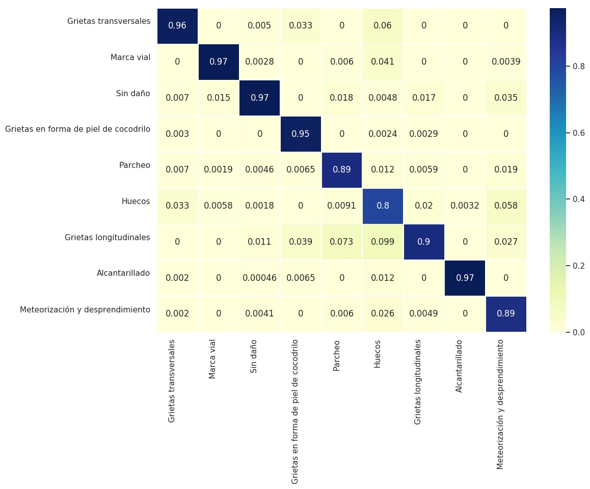

# SIMEPU
## SISTEMA INTEGRAL DE MANTENIMIENTO EFICIENTE DE PAVIMENTOS URBANOS

La red vial es uno de los mayores bienes patrimoniales de un país y proporciona una base fundamental 
para su desarrollo económico y social. Al mismo tiempo, su construcción, mantenimiento y uso produce un 
significativo impacto medioambiental.

Por ello, el mantenimiento de una red vial en buen estado es vital para reducir costes de transporte de personas 
y bienes, así como para no incurrir en sobrecostes por mantenimientos tardíos que obligan a una 
rehabilitación o reconstrucción.

En el siguiente repositorio trataremos de dar solución a la clasificación por imágen de los diferentes estados
en los que podemos encontrar el pavimento. Como el proyecto puede avanzar hacia la clasificación de un número
incremental de estados, dividiremos cada etapa experimental en consecuencia. 

## Etapa 1: Clasificación inicial

En esta primera etapa tratamos de dar solución a la clasificación de 9 diferentes estados iniciales:
  - Alcantarillado
  - Grietas en forma de piel de cocodrilo
  - Grietas longitudinales
  - Grietas transversales
  - Huecos
  - Marca vial
  - Meteorización y desprendimiento
  - Parcheo
  - Sin daño

|     Model    |   Pretrained  | Criterion | Optimizer |  Img Size  |  LR strategy  | Data Augmentation |      Extra       | Val Accuracy |
|:------------:|:-------------:|:---------:|:---------:|:----------:|:-------------:|:-----------------:|:----------------:|:------------:|
| resnet18     |      No       |    ce     |    sgd    |  224x224   |  steps 0.1    |         No        |   ------------   |    90.05%    |
| resnet18     |      No       |    ce     |    sgd    |  224x224   |  steps 0.01   |         No        |   ------------   |    90.55%    |
| resnet18     |      Si       |    ce     |    adam   |  224x224   |  steps 0.001  |         No        |   ------------   |    92.80%    |
| resnet18     |      Si       |    ce     |    adam   |  224x224   |  steps 0.001  |         Si        |   ------------   |    94.00%    |
| resnet18     |      Si       |    ce     |    adam   |  224x224   |  steps 0.001  |         Si        |   WeightedLoss   |    94.36%    |
| resnet50     |      Si       |    ce     |    adam   |  224x224   |  steps 0.001  |         Si        |   WeightedLoss   |    93.05%    |
| seresnext50  |      Si       |    ce     |    adam   |  224x224   |  steps 0.001  |         Si        |   WeightedLoss   |    94.12%    |

Matriz de confusión del mejor modelo:

