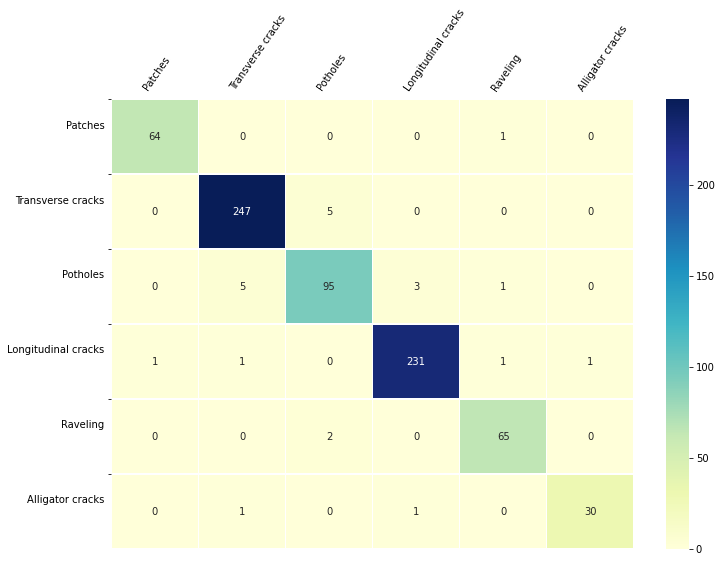

# SIMEPU
## AUTOMATIC IDENTIFICATION AND CLASSIFICATION OF URBAN PAVEMENT DISTRESSES THROUGH CONVOLUTIONAL NEURAL NETWORKS

The road network is one of the largest assets of a country and provides a fundamental basis
for its economic and social development. At the same time, its construction, maintenance, and use produce a
significant environmental impact.

Therefore, maintaining a road network in good condition is vital to reduce the cost of transporting people
and goods, as well as to avoid incurring additional costs for late maintenance that require a
rehabilitation or reconstruction.

In the following repository, we will try to solve the classification by the image of the different states
in which we can find the pavement. How the project can move towards classifying several incremental states, we will divide each experimental stage accordingly.

- Distresses: Alligator cracks / Longitudinal cracks / Transverse cracks / Raveling / Potholes / Patches
- No Distresses: Manholes / Road markings / Without Distresses

## Results Replication and Model Usage

Data has not been released but you can download our pretrained models and test them in your system. It is recommended to follow
our guidelines to get proper results. First download our models. 

```shell script
cd simepu_script
./get_models.sh
```

Next, you can use your own data calling the prediction script.

```shell script
# at simepu_script folder
python predict.py --img_sample samples/your_sample.jpg --get_overlay
```

With `get_overlay` parameter you will get for Cracks / Transverse cracks / Potholes / Patches classes the mask overlay too.

## Classification

Average Resnet34 Inference time: 0.005 seconds.

### Binary: Distresses vs No Distresses

In this stage, we want perform 'Damage' vs 'No Damage' binary classification. Training time per fold: 2 hours 30 minutes. Models were pretrained with Imagenet. 6351 train samples / 1588 validation samples. Time per epoch: 1'30''.

|   Model  | Fold | Accuracy | Precision | Recall |   F1   |
|:--------:|:----:|:--------:|:---------:|:------:|:------:|
| Resnet34 |   0  |  0.9950  |   0.9948  | 0.9948 | 0.9948 |
| Resnet34 |   1  |  0.9918  |   0.9895  | 0.9934 | 0.9915 |
| Resnet34 |   2  |  0.9899  |   0.9883  | 0.9908 | 0.9895 |
| Resnet34 |   3  |  0.9924  |   0.9905  | 0.9932 | 0.9918 |
| Resnet34 |   4  |  0.9943  |   0.9947  | 0.9933 | 0.9940 |
| Resnet34 | Mean |  0.9926  |   0.9915  | 0.9930 | 0.9923 |


### Distresses

In this stage, we want classify only the distresses. Training time per fold: 1 hour 15 minutes. 3020 train samples / 755 validation samples. Time per epoch: 45''.
  
|   Model  | Fold | Accuracy | Balanced Accuracy |
|:--------:|:----:|:--------:|:-----------------:|
| Resnet34 |   0  |  0.9762  |       0.9759      |
| Resnet34 |   1  |  0.9836  |       0.9798      |
| Resnet34 |   2  |  0.9775  |       0.9804      |
| Resnet34 |   3  |  0.9828  |       0.9746      |
| Resnet34 |   4  |  0.9801  |       0.9747      |
| Resnet34 | Mean |  0.9804  |       0.9770      |



 

### All classes

We want compare our proposed 2 network framework with only 1 model that classifies all 9 different classes. Training time per fold: 2 hours 30 minutes. 6351 train samples / 1588 validation samples. Time per epoch: 1'35''

|   Model  | Fold | Accuracy | Balanced Accuracy |
|:--------:|:----:|:--------:|:-----------------:|
| Resnet34 |   0  |  0.9836  |       0.9787      |
| Resnet34 |   1  |  0.9824  |       0.9795      |
| Resnet34 |   2  |  0.9729  |       0.9757      |
| Resnet34 |   3  |  0.9798  |       0.9713      |
| Resnet34 |   4  |  0.9861  |       0.9797      |
| Resnet34 | Mean |  0.9809  |       0.9769      |


## Segmentation

All distresses share same network. Inference time 0.025 seconds.

### Longitudinal cracks

Training time per fold: 2 hours. 767 train samples / 192 validation samples. Time per epoch: 1'20''. 

|       Model      | Fold |    IOU   |       DICE        |
|:----------------:|:----:|:--------:|:-----------------:|
| unet_extra_small |   0  |  0.6682  |       0.7950      |
| unet_extra_small |   1  |  0.6725  |       0.8000      |
| unet_extra_small |   2  |  0.6904  |       0.8140      |
| unet_extra_small |   3  |  0.6912  |       0.8149      |
| unet_extra_small |   4  |  0.6884  |       0.8074      |
| unet_extra_small | Mean |  0.6821  |       0.8062      |

### Transverse cracks

Training time per fold: 1 hour. 456 train samples / 114 validation samples. Time per epoch: 50''.

|       Model      | Fold |    IOU   |       DICE        |
|:----------------:|:----:|:--------:|:-----------------:|
| unet_extra_small |   0  |  0.6692  |       0.7948      |
| unet_extra_small |   1  |  0.6608  |       0.7887      |
| unet_extra_small |   2  |  0.6666  |       0.7966      |
| unet_extra_small |   3  |  0.6863  |       0.8111      |
| unet_extra_small |   4  |  0.6717  |       0.8002      |
| unet_extra_small | Mean |  0.6709  |       0.7982      |

### Patches

Training time per fold: 1 hour. 295 train samples / 74 validation samples. Time per epoch: 35''.

|       Model      | Fold |    IOU   |       DICE        |
|:----------------:|:----:|:--------:|:-----------------:|
| unet_extra_small |   0  |  0.8652  |       0.9029      |
| unet_extra_small |   1  |  0.8789  |       0.9244      |
| unet_extra_small |   2  |  0.9118  |       0.9435      |
| unet_extra_small |   3  |  0.8533  |       0.8920      |
| unet_extra_small |   4  |  0.8713  |       0.9206      |
| unet_extra_small | Mean |  0.8760  |       0.9166      |

### Potholes

Training time per fold: 1 hour. 320 train samples / 81 validation samples. Time per epoch: 40''.

|       Model      | Fold |    IOU   |       DICE        |
|:----------------:|:----:|:--------:|:-----------------:|
| unet_extra_small |   0  |  0.5828  |       0.7162      |
| unet_extra_small |   1  |  0.6363  |       0.7515      |
| unet_extra_small |   2  |  0.6094  |       0.7424      |
| unet_extra_small |   3  |  0.6136  |       0.7486      |
| unet_extra_small |   4  |  0.6016  |       0.7322      |
| unet_extra_small | Mean |  0.6087  |       0.7381      |