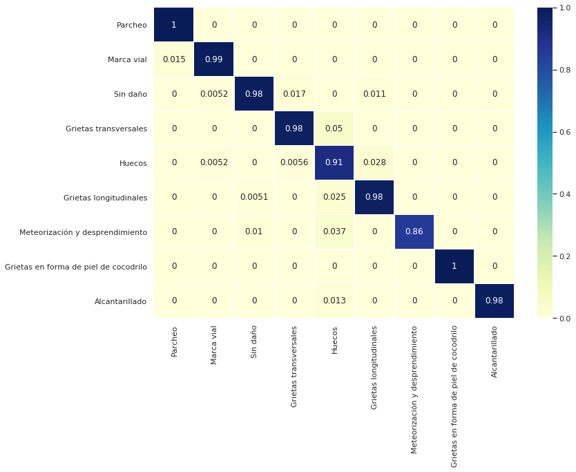
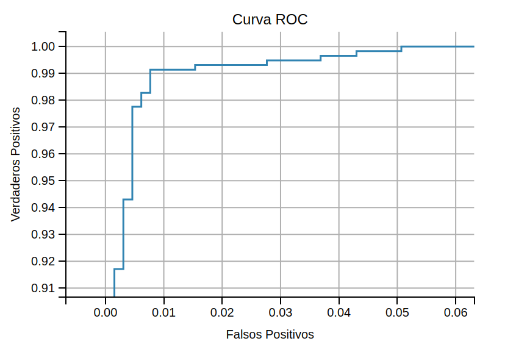
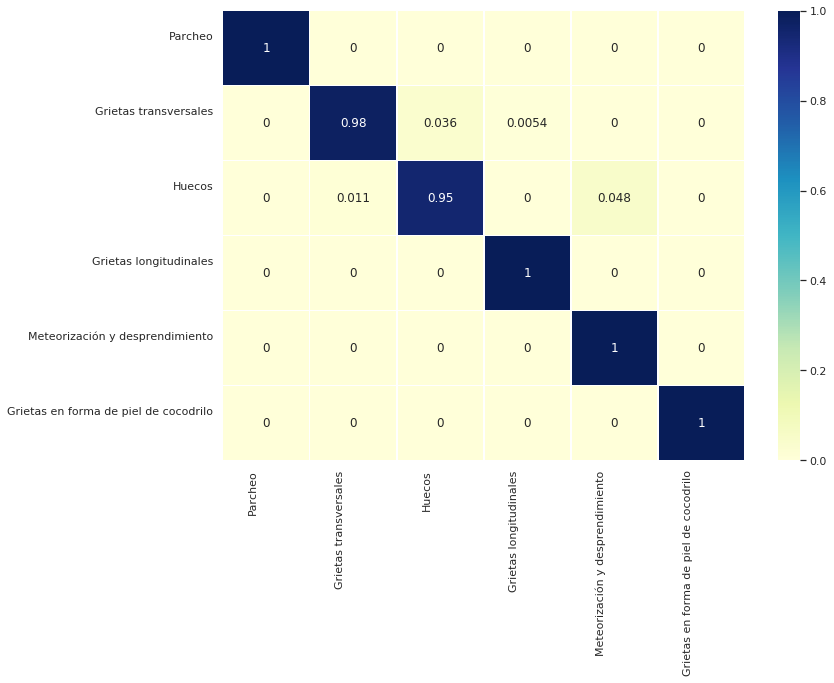

# SIMEPU
## SISTEMA INTEGRAL DE MANTENIMIENTO EFICIENTE DE PAVIMENTOS URBANOS

La red vial es uno de los mayores bienes patrimoniales de un país y proporciona una base fundamental 
para su desarrollo económico y social. Al mismo tiempo, su construcción, mantenimiento y uso produce un 
significativo impacto medioambiental.

Por ello, el mantenimiento de una red vial en buen estado es vital para reducir costes de transporte de personas 
y bienes, así como para no incurrir en sobrecostes por mantenimientos tardíos que obligan a una 
rehabilitación o reconstrucción.

En el siguiente repositorio trataremos de dar solución a la clasificación por imágen de los diferentes estados
en los que podemos encontrar el pavimento. Como el proyecto puede avanzar hacia la clasificación de un número
incremental de estados, dividiremos cada etapa experimental en consecuencia. 

Para visualizar todos los experimentos realizados ejecutar: `tensorboard --logdir=results/logs`

## Clasificación: Todas las clases

En esta primera etapa tratamos de dar solución a la clasificación de 9 diferentes estados iniciales:
  - Alcantarillado
  - Grietas en forma de piel de cocodrilo
  - Grietas longitudinales
  - Grietas transversales
  - Huecos
  - Marca vial
  - Meteorización y desprendimiento
  - Parcheo
  - Sin daño

|     Model    | Criterion  | Optimizer |  Img Size  |  LR strategy  | Data Augmentation |      Extra       | Val Accuracy |
|:------------:|:----------:|:---------:|:----------:|:-------------:|:-----------------:|:----------------:|:------------:|
| resnet34*    |     ce     |    adam   |  224x224   |  steps 0.0001 |         Si        |   WeightedLoss   |    97.88%    |

- Train Analysis
  - Accuracy of Parcheo : 100.00% 
  - Accuracy of Marca vial : 99.48% 
  - Accuracy of Sin daño : 98.47% 
  - Accuracy of Grietas transversales : 97.77% 
  - Accuracy of Huecos : 91.25% 
  - Accuracy of Grietas longitudinales : 97.75% 
  - Accuracy of Meteorización y desprendimiento : 85.71% 
  - Accuracy of Grietas en forma de piel de cocodrilo : 100.00% 
  - Accuracy of Alcantarillado : 98.48% 

*: Preentrenado en Imagenet

Matriz de confusión del mejor modelo:

## Daño vs. No Daño

En esta segunda etapa tratamos de dar solución a la clasificación de las clases `Daño` y `No Daño`:
  - Daño: Grietas en forma de piel de cocodrilo / Grietas longitudinales / Grietas transversales / Huecos / Meteorización y desprendimiento / Parcheo
  - No Daño: Alcantarillado / Marca vial / Sin Daño

|     Model    | Criterion  | Optimizer |  Img Size  |  LR strategy  | Data Augmentation |      Extra       |   Accuracy   |
|:------------:|:----------:|:---------:|:----------:|:-------------:|:-----------------:|:----------------:|:------------:|
| resnet34*    |     ce     |    adam   |  224x224   |  steps 0.0001 |         Si        |   ------------   |    99.18%    |

*: Preentrenado en Imagenet

- Area bajo curva ROC: 0.9992
  - True Positive 100.00% para FP ratio 10.00%
  - True Positive 99.83% para FP ratio 5.00%
  - True Positive 99.31% para FP ratio 2.50%
  - True Positive 99.14% para FP ratio 1.00%
  - True Positive 97.75% para FP ratio 0.50%
  - True Positive 97.75% para FP ratio 0.40%
  - True Positive 93.44% para FP ratio 0.30%
  - True Positive 87.56% para FP ratio 0.20%
  - True Positive 87.56% para FP ratio 0.10%
  
Esto es, para un ratio de Falsos positivos (NoDaño clasificado como Daño) del 0.4% (4 de cada 1000 muestras), 
en el cual molestaríamos a un operario experto, los casos de Daño clasificados como tal (True Positive) son del 97.75%,
colandosenos por lo tanto alrededor de 22 muestras dañadas de cada 1000.

 
## Daños

Por otra parte, queremos estudiar cómo sería la clasificación de los daños al tratarlos estos de forma aislada; Clasificación de las clases `Daño`:
  - Daño: Grietas en forma de piel de cocodrilo / Grietas longitudinales / Grietas transversales / Huecos / Meteorización y desprendimiento / Parcheo
  
|     Model    | Criterion  | Optimizer |  Img Size  |  LR strategy  | Data Augmentation |      Extra       |   Accuracy   |
|:------------:|:----------:|:---------:|:----------:|:-------------:|:-----------------:|:----------------:|:------------:|
| resnet34*    |     ce     |    adam   |  224x224   |  steps 0.0001 |         Si        |   ------------   |    98.80%    |

*: Preentrenado en Imagenet

- Train Analysis
  - Accuracy of Parcheo : 100.00% 
  - Accuracy of Grietas transversales : 97.85% 
  - Accuracy of Huecos : 95.18% 
  - Accuracy of Grietas longitudinales : 100.00% 
  - Accuracy of Meteorización y desprendimiento : 100.00% 
  - Accuracy of Grietas en forma de piel de cocodrilo : 100.00% 
  
 